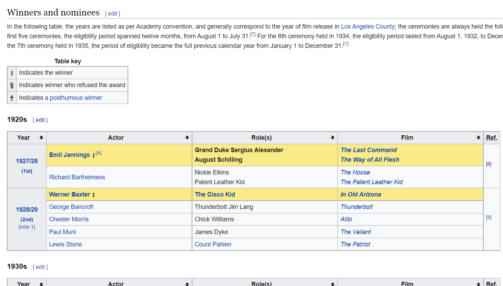
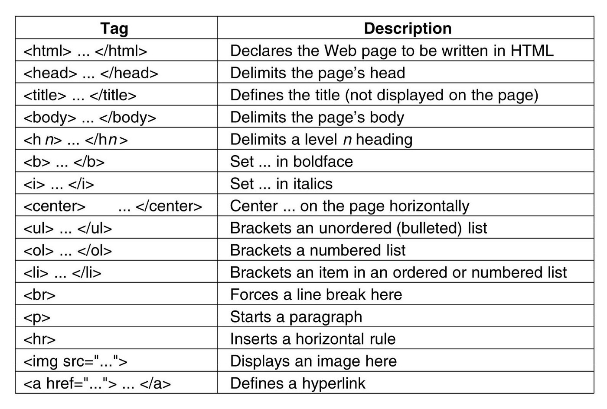
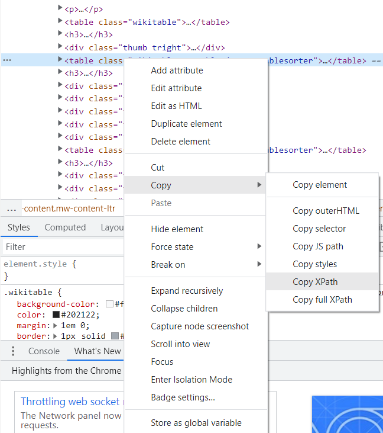

# Web scraping tables tutorial

Zoey Wee


Sometimes just getting data into R is as stressful and difficult as actually working with the imported data if they are not of the form that is easy to handle such as csv.
It would be the best if we take the time and learn how to use the API if there exists one that matches your goal, and we should do so for projects,
but we do face situations where we have to quickly get the data.
This tutorial might be helpful when that happens to you and you try to import data from tables on websites into R.

I will proceed with the specific data/table as an example, and you will be able to use it for your purpose.

I'm going to import the following 1920s table from Wikipedia into R.


<p>&nbsp;</p> 
## Basic HTML web tags
<p>&nbsp;</p>
Before we start, let's have a look at a list of basic HTML web tags.

<p>&nbsp;</p> 
## Packages
<p>&nbsp;</p>
First, include these packages. 
We need 'rvest' package, which includes wrappers around the 'xml2' and 'httr' packages that make it easy to download, then manipulate HTML and XML.
<p>&nbsp;</p>
library(rvest)
<p>&nbsp;</p>
library(tidyverse)
<p>&nbsp;</p> 
## Things we need
<p>&nbsp;</p>
We need the following information to continue:

1. Web address of the page containing the table
2. Tag of the table in the html code

You can get 1 by just copying the URL of the webpage.
Example)
https://en.wikipedia.org/wiki/Academy_Award_for_Best_Actor
<p>&nbsp;</p> 

In order to get 2, we need to inspect the html code.
Let's see how we can do that.

Websites are built from lines of code, but the results are pages with images, videos, fonts, and other features. To change one of those elements or see what it consists of, find the line of code that controls it. To do that, we can use an element inspection tool. 
In Google Chrome, you can inspect a web page using the browser's built-in Chrome DevTools:
<p>&nbsp;</p>
Right-click(Control+Click on MAC) an element on the page or in a blank area (near the element), then select Inspect.
<p>&nbsp;</p>
As you move the pointer over source code, Inspector automatically finds and highlights the element. You will see a line starting <table class= ...
If there are multiple tables on the page, it might take some trial and error to get the right table that you want.
<p>&nbsp;</p> 

<p>&nbsp;</p> 
What we need from this is the XPath. XPath (XML Path Language) is an expression language designed to support the query or transformation of XML documents. It can be used to compute values (e.g., strings, numbers, or Boolean values) from the content of an XML document.
<p>&nbsp;</p> 
(Quick summary of difference between XML and HTML:
XML is abbreviation for extensible Markup Language whereas HTML stands for Hypertext Markup Language. XML mainly focuses on transfer of data while HTML is focused on presentation of the data. XML is content driven whereas HTML is format driven. XML is Case sensitive while HTML is Case insensitive.)
<p>&nbsp;</p> 
We can copy the XPath by right-clicking the line starting <table class= ...!, selecting Copy -> Copy XPath.




Example)
//*[@id="mw-content-text"]/div[1]/table[3]
<p>&nbsp;</p> 
## Web scraping
<p>&nbsp;</p>

Now we have both information, we can proceed to reading the table.
We are using the web address as the parameter for read_html function.
Use the function html_table to get the table from the website by setting the tag of the table as the parameter 'xpath' for html_node function.
<p>&nbsp;</p> 

```r
page <- read_html("https://en.wikipedia.org/wiki/Academy_Award_for_Best_Actor")

data <- page %>%
    html_node(xpath='//*[@id="mw-content-text"]/div[1]/table[3]') %>%
    html_table()

data
```

```
## # A tibble: 7 × 5
##   Year                 Actor               `Role(s)`                 Film  Ref. 
##   <chr>                <chr>               <chr>                     <chr> <chr>
## 1 1927/28 (1st)        Emil Jannings [A]   Grand Duke Sergius Alexa… The … [8]  
## 2 1927/28 (1st)        Richard Barthelmess Nickie ElkinsPatent Leat… The … [8]  
## 3 1928/29(2nd)[note 1] Warner Baxter       The Cisco Kid             In O… [9]  
## 4 1928/29(2nd)[note 1] George Bancroft     Thunderbolt Jim Lang      Thun… [9]  
## 5 1928/29(2nd)[note 1] Chester Morris      Chick Williams            Alibi [9]  
## 6 1928/29(2nd)[note 1] Paul Muni           James Dyke                The … [9]  
## 7 1928/29(2nd)[note 1] Lewis Stone         Count Pahlen              The … [9]
```
It was successful!
Remember that you might need further data cleaning.

<p>&nbsp;</p>
Sources:
<p>&nbsp;</p> 
https://en.wikipedia.org/wiki/Academy_Award_for_Best_Actor
<p>&nbsp;</p> 
https://www.guru99.com/xml-vs-html-difference.html#:~:text=XML%20is%20abbreviation%20for%20extensible,while%20HTML%20is%20Case%20insensitive.
<p>&nbsp;</p> 
https://www.thoughtco.com/get-inspect-element-tool-for-browser-756549
<p>&nbsp;</p> 
https://cran.r-project.org/web/packages/rvest/rvest.pdf
<p>&nbsp;</p> 
https://mason.gmu.edu/~kshiffl4/375/module5-2.html
<p>&nbsp;</p> 
https://en.wikipedia.org/wiki/XPath
<p>&nbsp;</p> 
https://twitter.com/juliasilge/status/951639629182074880?ref_src=twsrc%5Etfw%7Ctwcamp%5Etweetembed%7Ctwterm%5E951639629182074880%7Ctwgr%5E%7Ctwcon%5Es1_&ref_url=https%3A%2F%2Fwww.adam-campbell.com%2Fpost%2Fscraping-wikpedia-tables%2F
<p>&nbsp;</p> 
https://support.testsigma.com/support/solutions/articles/32000024747-advanced-xpath-expression-for-locating-dynamic-elements-in-tables
